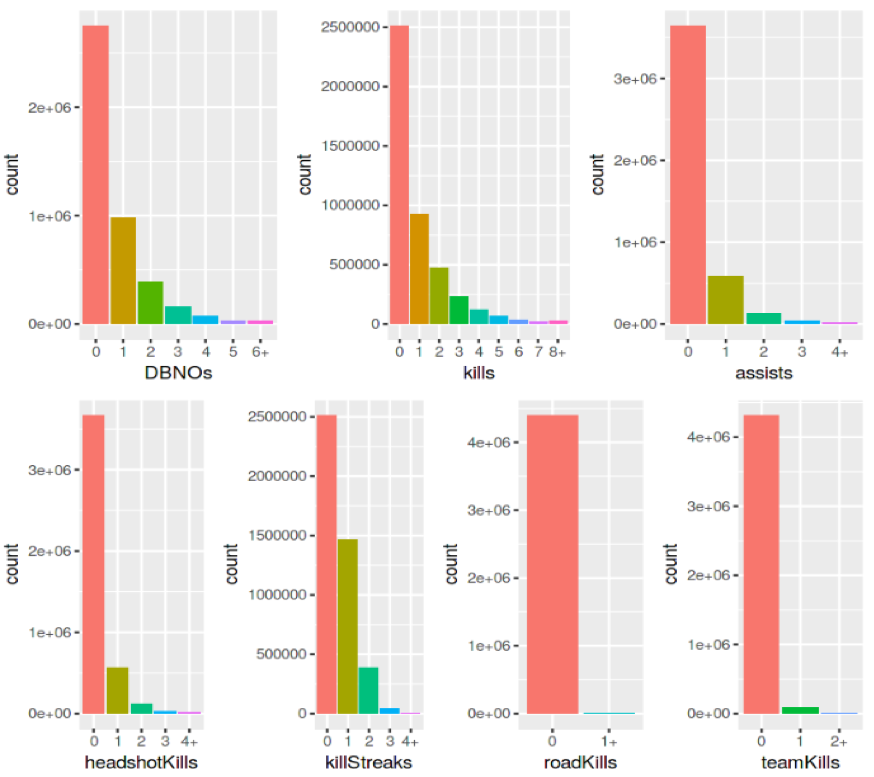
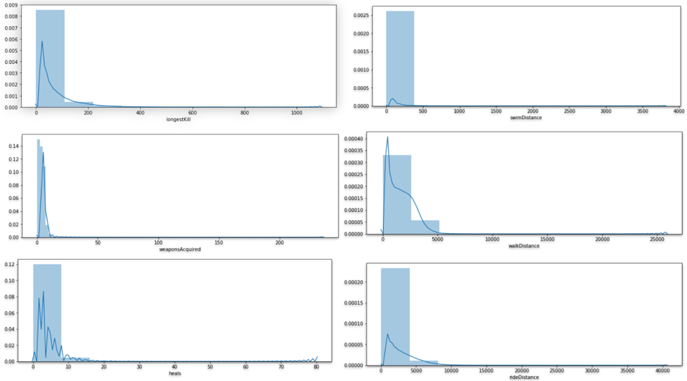
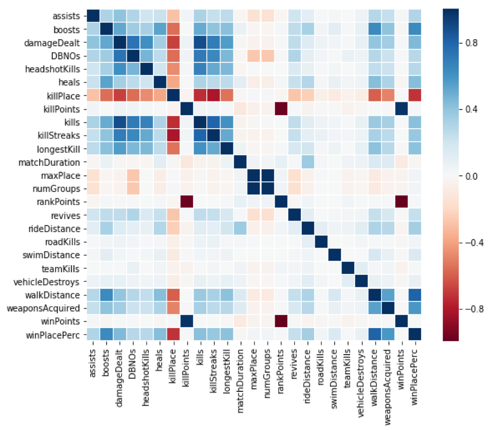
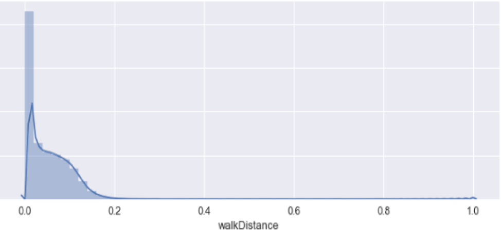
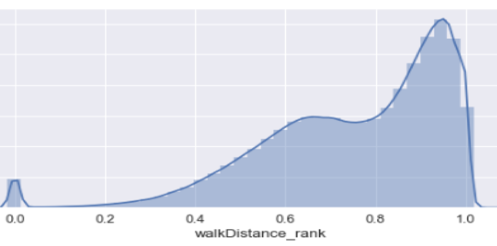
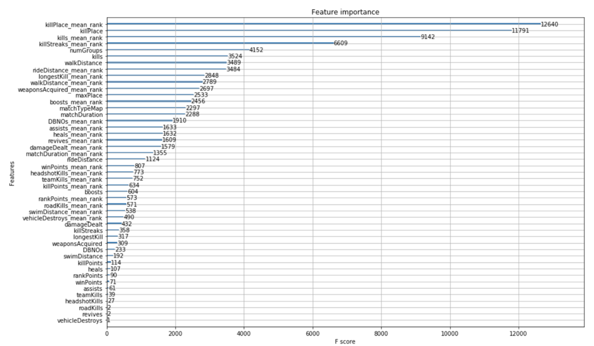

# PUBG-Finish-Placement-Prediction

So, where we droppin' boys and girls?

Battle Royale-style video games have taken the world by storm. 100 players are dropped onto an island empty-handed and must explore, scavenge, and eliminate other players until only one is left standing, all while the play zone continues to shrink.

PlayerUnknown's BattleGrounds (PUBG) has enjoyed massive popularity. With over 50 million copies sold, it's the fifth best selling game of all time, and has millions of active monthly players.

The team at PUBG has made official game data available for the public to explore and scavenge outside of "The Blue Circle." 

We collect 65,000 games' worth of anonymized player data to predict final placement from final in-game stats and initial player ratings.

What's the best strategy to win in PUBG? Should you sit in one spot and hide your way into victory, or do you need to be the top shot? Let's let the data do the talking!

## Overview
It is the winning placement percentage of each player in the match that we need to predict. After preprocessing the data, We conduct feature engineering by transforming the data, adjusting some variables and extracting the important features, and achieve some visible improvements on the results of our models. 6 models are fitted in total, including basic models like linear regression and advanced models, such as PCA combined with Lasso, Random Forest, Neural Network, and XGBoost. After several trials of tuning the parameters, the final best mean absolute error we achieved is 0.028, which is generated by the model XGBoost. Our final ranking is at top 13% on the Kaggle leaderboard.

## Data Visualization

In the total 28 predictors, 24 of them are numeric variables and the other 4 are objects, which is Id, groupId, matchId and match type. The three ids identify the players’ information of each group in each match they participated. And the match type indicates that the dataset contains players’ performance and placement from 16 different match type.

Players playing solo-match have their own placement, while the players from the same group share the same placement.

The number of groups in each match type is different. The picture of numGroups tells the feature of match type even if you are not a player of the game, i.e. In solo matches, there are around 100 single players, each of whom is a group. And in terms of Duo, the yellow curve indicates that it is a two-person match type, with around 50 groups in each match. So does the squad.

The players’ killing statistics tell us an interesting story. These pictures indicate that in the killing game, the majority of the players kills no one in a single match in all forms of killing methods, whether by themselves or by assisting teammates. Hence, the minority of the players who are really experienced and skilled determine the leaderboard at the end of the match.
 

As we plot the variable distributions, the average level of the players in each feature are as the blue bar. And we find some particular players who could kill people without moving (1535), with 100% headshot rate (20), killed someone 1000 miles away (23), travels more than 10000 miles by foot, acquired more than 80 weapons (19) and so on.Hence, we remove these extreme records with a threshold of no more than 99.5% of the whole dataset, ensuring the least damage to the original data.

The correlation matrix indicates that there are a few variables highly correlated with response, of which the highest positive correlation is the ‘walkDistance’ and the highest negative is the killPlace.

It is possible that the highly correlated variables ( walkDistance, killPlace, boosts, weaponAcquired, damageDealt ) might be the most important features in predicting winPlacePerc. This corresponds with our intuition, because weapons, supplies, and movements all are very import elements on the battlefield.

## Feature Engineering

###  Normalize Features

Based on the "playersJoined" feature we can create a lot of others to normalize their values. For example we can create the "killsNorm" and "damageDealtNorm" features. When there are 100 players in the game it might be easier to find and kill someone, than when there are 90 players.
- killsNorm = kills / playersJoined 
- damageDealtNorm = damageDealt / playersJoined 

Because heals and boost are similar, so do the swimDistance , walkDistance and rideDistance, thus we add they together
- items= heals + boosts
- total_distance = swimDistance +  walkDistance +  rideDistance

We can also use walkDistance to normalize other features
- walkDistance_over_kills = walkDistance / kills
- walkDistance_over_heals = walkDistance / heals 
- walkDistance_over_boosts = walkDistance / boosts

some other features created 
- teamwork = assist + revive
- headshotKills_over_kills
- players_in_team

We add those features to dataframe and run the most simple linear regression ( Because the more complicated the model is the more time it takes, in order to make the feature engineering faster, we always try linear regression first if the result is good then we try some more complicated model) 

### Group Features by Teams
Because the game is played by teams ( usually there is 2 or 4 players in a team according the the match type). The winPlacePerc is decided by the performance of the whole team, so we try different ways to group feature by teams

- min_by_team
- max_by_team
- sum_by_team
- mean_by_team
- median_by_team

For every feature now we have, we create 5 new features with 5 different ways to represent the performance of the whole team. 

### Ranking in Matchs
In reality, the winPlacePerc is decided by the relative performances of a team compared to other teams in a single match but not the absolute performances over all matches. So we tried to transform the original features to ranking features which represent the ranking place of a team in a match. By this method, we not only normalize the data among different matches, but also normalize different features into the same scale.

Considering the ranking method used in the last try destroys the distance, (For example
suppose there are three teams,  team A kills 20 enemies, team B kills 10 enemies and team C kills 9 enemies. However the ranking is 1,2 and 3. Apparently the difference between team A and team B is not the same with the difference between team B and Team C)  we try another way to rank.
- rank_2 = x- x.min / x.max - x.min 

After we look through the rank, we found out this method actually destroy information even further, because as you can from the picture below, the rankings are all squeezed into a small interval( 0-0.2) due to the maximum value is to large.

So we came out of another way of ranking, using log() to solve the problem, for the reason that the log function is able to narrow the distances among the dispersed large values by logarithmically scaling the data.
- rank_3  = log (x+1) / log (x.max)

## Model 
- linear regression
- PCA combined with Lasso
- Random Forest
- Neural Network
- XGBoost

## Conlusion

In PUBG, if you can find a vehicle , keep moving, or search more boosts items, or killing enemies (JUST DO SOMETHING!!!), you can win the chicken dinner

The final best mean absolute error we achieved is 0.028, which is generated by the model XGBoost. Our final ranking is at top 13% on the Kaggle leaderboard.

