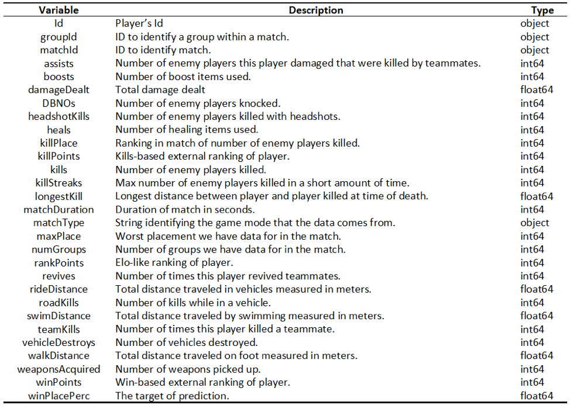
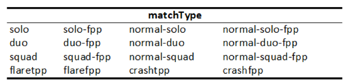
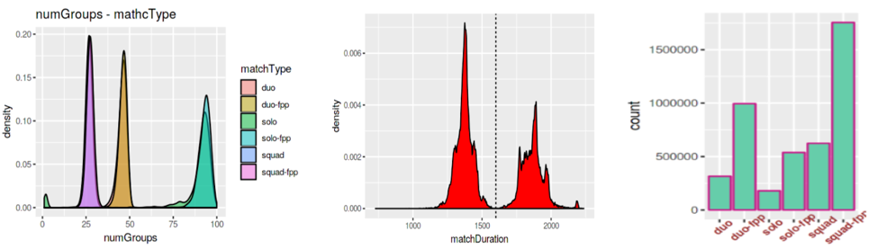

# PUBG-Finish-Placement-Prediction

So, where we droppin' boys and girls?

Battle Royale-style video games have taken the world by storm. 100 players are dropped onto an island empty-handed and must explore, scavenge, and eliminate other players until only one is left standing, all while the play zone continues to shrink.

PlayerUnknown's BattleGrounds (PUBG) has enjoyed massive popularity. With over 50 million copies sold, it's the fifth best selling game of all time, and has millions of active monthly players.

The team at PUBG has made official game data available for the public to explore and scavenge outside of "The Blue Circle." 

We collect 65,000 games' worth of anonymized player data to predict final placement from final in-game stats and initial player ratings.

What's the best strategy to win in PUBG? Should you sit in one spot and hide your way into victory, or do you need to be the top shot? Let's let the data do the talking!

## Overview
It is the winning placement percentage of each player in the match that we need to predict. After preprocessing the data, We conduct feature engineering by transforming the data, adjusting some variables and extracting the important features, and achieve some visible improvements on the results of our models. 8 models are fitted in total, including basic models like zero-R, linear regression and beta regression, and advanced models, such as PCA combined with Lasso, Random Forest, Neural Network, and XGBoost. After several trials of tuning the parameters, the final best mean absolute error we achieved is 0.028, which is generated by the model XGBoost. Our final ranking is at top 13% on the Kaggle leaderboard.

## Data

In the total 28 predictors, 24 of them are numeric variables and the other 4 are objects, which is Id, groupId, matchId and match type. The three ids identify the players’ information of each group in each match they participated. And the match type indicates that the dataset contains players’ performance and placement from 16 different match type.

Players playing solo-match have their own placement, while the players from the same group share the same placement.

The number of groups in each match type is different. The picture of numGroups tells the feature of match type even if you are not a player of the game, i.e. In solo matches, there are around 100 single players, each of whom is a group. And in terms of Duo, the yellow curve indicates that it is a two-person match type, with around 50 groups in each match. So does the squad.

## Data Visualization

